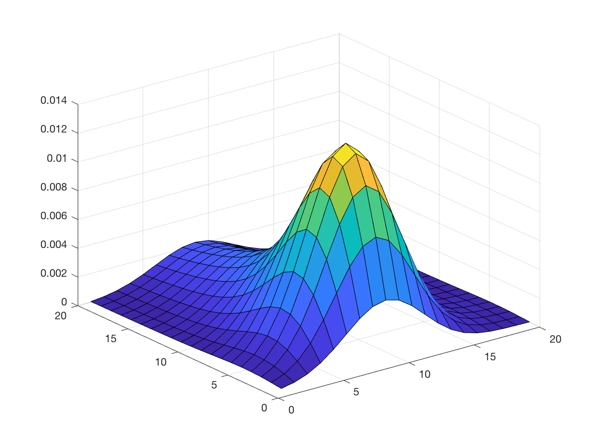

# Parrallel-Distributed-2D-Torus-Random-Walk
 
The key idea in this program is to implement a parallel version of a Markov chain simulation of a “random walk on a 2-D torus” https://en.wikipedia.org/wiki/Random_walk.

## Table of contents
* [General Information](#general-information)
* [Surface Plot](#surface-plot)
* [File Description](#file-description)
* [Code Examples](#code-examples)
* [Contact](#contact)

## General Information
K-means clustering is an important unsupervised learning algorithm. However, the sequential k-means algorithm is inefficient to cluster the large real-world data. Thus I wrote the parallel distributed version of the K-means algorithm to decrease the wall time required.

The algorithm has two important parts in each iteration after initialization: 1). Each process will perform local operations to obtain the the counter of clusters and summation of points of different clusters. MPI_All_Reduce was used to allow the communication between processors and add up the result. 2). Reset centroids using the result from 1) in root processor, and broadcast the new centroids to every processors.

## File Description
'main.c' is the main driver. 

'makefile' is used for compiling the program efficiently.

The 'aux.c' contains a set of auxilliary functions, which includes 'OneStep' function (used to update probability for each iteration), 'ComputErr' function (used to compute the maximum difference between two processors) and 'get_prob' function (used for generating the probability stencil).

The header file 'inc.h' contains the definition of two data types PointProb and myDomain. PointProb contains an array of probability (stays, west,east, north and south), and myDomain contains information of current domain, such as location, current processor rank, neighbor processor rank, and buffer for boundary cells.

The MATLAB script 'checkOutp.m' is used to generate the sufrace plot of the probability distribution after convergence.

## Surface Plot
This is a surface plot of the probability distribution after convergence generated by checkOutp.m.


## Code Examples
To build the executable program main.ex, run:
```bash
make
```
The program could be run on the phiXX.cselabs.umn.edu cluster by running:
```bash
mpirun [ -np X ] [ --hostfile <filename> ] <program>
```
where X is the number of processors, and -hostfile is used for specifying host nodes. For example:
```bash
mpirun -np 16 -hostfile hostfile -map-by node  main.ex
```
where X = 16, <filename> is hosts, and -map-by node will load balance the processes across the available nodes, numbering each process in a round-robin fashion.

To verify the correctness of the program, run:
```bash
python3 solver.py
```
The output should be
```bash
number of correct labels =  1021 / 1021
```
## Contact
Created by Buyun Liang [liang664@umn.edu] (https://www.linkedin.com/in/buyun-liang/) - feel free to contact me if you have any questions!
